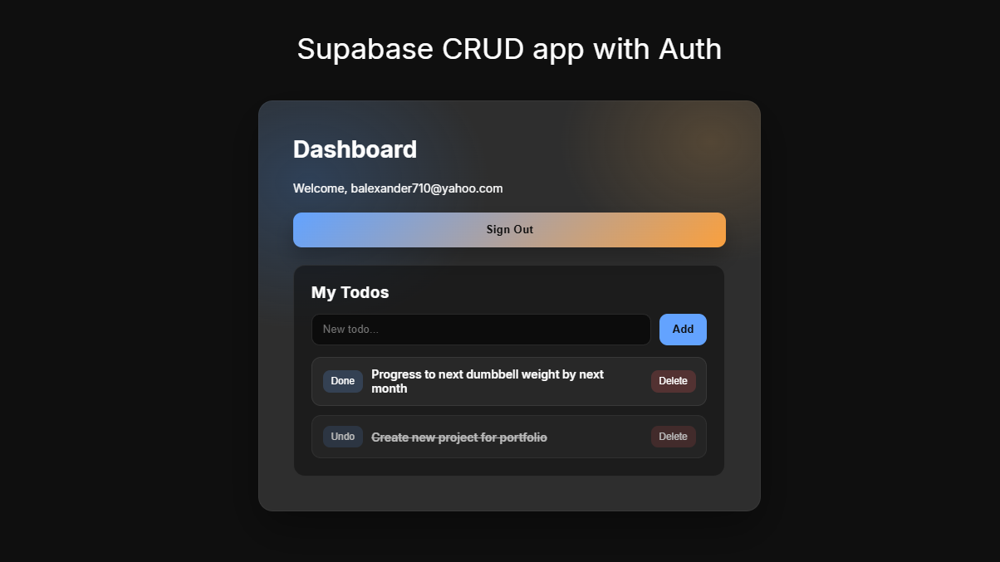

# Supabase CRUD Auth (Todo Dashboard)

A simple React + Vite app using Supabase for email/password auth and a basic todo CRUD list inside the dashboard.



## Features

- Supabase authentication (sign up, sign in, sign out)
- Protected dashboard route
- Todo CRUD (create, read, update, delete) scoped to the signed-in user

## Tech Stack

- React
- Vite
- Supabase

## Getting Started

1) Install dependencies

```
npm install
```

2) Create a Supabase project and add a `todos` table with RLS enabled.

Suggested schema:

- `id` uuid (primary key, default `gen_random_uuid()`)
- `user_id` uuid (references `auth.users`)
- `title` text
- `is_complete` boolean (default `false`)
- `created_at` timestamptz (default `now()`)

3) Add environment variables

Create a `.env` file in the project root:

```
VITE_SUPABASE_URL=your_supabase_url
VITE_SUPABASE_ANON_KEY=your_supabase_anon_key
```

4) Run the app

```
npm run dev
```

## Notes

- Todos are filtered by the current user via `user_id`.
- If you change the schema, update the Supabase queries in the dashboard.
